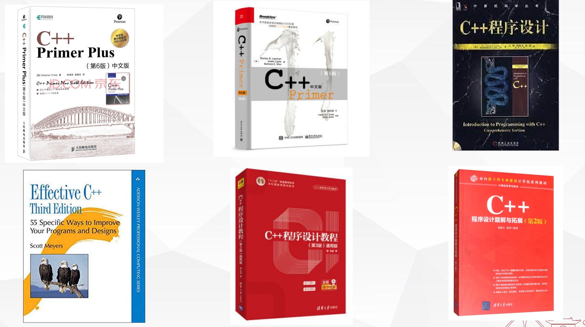

# SJTU-AI1802: 程序设计基础（荣誉）

<!-- 课程的基本信息简介 -->
<!-- 这一部分主要记录老师们上课的客观信息，例如考核方式和授课范围等 -->
## 课程基本信息简介

<!-- 下面一行请勿删除，注意缩进 -->
<!-- markdown 格式详见: https://squidfunk.github.io/mkdocs-material/reference/admonitions/ -->
!!! info "Basic information"

    :fontawesome-solid-bolt:{ .lightning } 课程教师：王钰

    :fontawesome-solid-bolt:{ .lightning } 授课内容与范围：C++基本编程语法知识（变量、循环、分支、函数、还有面向对象基础）

    :fontawesome-solid-bolt:{ .lightning } 学时&学分：4学分

    :fontawesome-solid-bolt:{ .lightning } 考核方式：50%的期末考试 + 5%的期中考试 + 45%的平时成绩（包括平时上机 & 课后作业等），无签到考核

<!-- You are free to add some contents in it! -->
## 其他信息

- 课程大纲：[Course Information](https://pan.sjtu.edu.cn/web/share/be74691642d5456ecff9fb44ff7f7caa)

- 有关课程的教材推荐：

<!-- 对课程的主观性评价请放在这里，包括对学弟学妹的建议等等 -->
<!-- markdown 格式详见: https://squidfunk.github.io/mkdocs-material/reference/admonitions/ -->
## 课程评价

??? success "别让分数定义这门课程"

    作为各位在大学中接触到的第一门与编程有关的课程，这门课的重要性**不言而喻**。是的，在大学有些课你考完期末考试一个月后就会忘记这门课50%甚至80%的知识，但是**这门课不会**，编程基础是后续许多课程的基石，没有好的代码能力，后面的课程会寸步难行。

    课程无论是给分还是授课质量都很好，王老师讲的很细致，也给予了我们很高的自由度，每一次上机课和作业都会安排对应的评讲的习题课，本身也没有什么可以吐槽的点。期末考试**纯粹八股文**，这是致远这门课程的通病，不过在“会编程”的基础之上掌握这些比较抽象的概念其实也挺重要的。因此想拿高分的同学务必在考前要看一下往年的卷子，很多埋的很深的坑只有在做过一遍之后才会察觉到。

    但是，正如标题所言，**别让分数定义了这门课程**，就这门课而言，学到真知识肯定远远比期末考出好成绩重要的多，因此笔者给出如下的建议：

    - 对于编程新手：**多写代码**，少用AI，少抄书，自己敲出来的才是真本事。

    - 如果你学有余力，你可以探索更加广阔的世界，程序设计的重心在于“**正确的语法**”，即如何写出“能跑通”的代码，但是会用锤子和善用锤子肯定不是一码事，你可以往以下几个方面探索：

        - **数据结构与算法**：这也是大一下一门相当重要的专业课，在程设课上会涉及一些**基本的算法实现**（二分，贪心，动态规划），但是所涉及较浅，可以自行深入。（LeetCode刷起来）同时，可以**额外学习[STL](https://en.cppreference.com/w/cpp/standard_library.html)**的基本使用方法，对后续课程颇有裨益。

        - **现代编程语言**：课程上讲解的C++语法一般是C++98的语法，裸指针满天飞，而现代C++编程依赖于更高级的语法组件和概念，提升了安全性和更丰富的功能（自动类型推导，智能指针，移动语义，多线程等），可以不断先后延伸学习，参考网站：[Cpp Reference](https://cppreference.com/)。与此同时，很多其他编程语言都是 C-style Languages，在Cpp的基础上上手学习第二门语言的难度会小很多。

        - **软件开发 & 设计模式**：设计一个类不等同于设计一个好的类，面向对象编程的核心（封装，抽象）以及 [SOLID](https://en.wikipedia.org/wiki/SOLID) 原则等知识因为课程容量的问题往往鲜有提及。**设计模式**是解决软件设计中常见问题的经典方法，帮助开发者在不重复造轮子的情况下，写出更灵活，可维护的代码。资料推荐：[https://refactoringguru.cn/design-patterns/cpp](https://refactoringguru.cn/design-patterns/cpp)

    相信我，这门课一定会非常充实 :)

    !!! info "资料推荐"

        - csdiy 上推荐的C++开发相关课程：

            - [AUT-1400](https://csdiy.wiki/%E7%BC%96%E7%A8%8B%E5%85%A5%E9%97%A8/cpp/AUT1400/)

            - [Standard C++ Programming](https://csdiy.wiki/%E7%BC%96%E7%A8%8B%E5%85%A5%E9%97%A8/cpp/CS106L/#_1)

            - [Programming Abstractions in C++](https://csdiy.wiki/%E7%BC%96%E7%A8%8B%E5%85%A5%E9%97%A8/cpp/CS106B_CS106X/)

        - ACM班的Class Wiki: [Programming 2024](https://acm.sjtu.edu.cn/wiki/Programming_2024)

        - 一些课件：
            - [CS1604-Lectures-SJTU](https://pan.sjtu.edu.cn/web/share/5b95f2b88bad1d6ffbb5b28362dbd4fe)

            - [AI1802-Lectures-SJTU](https://pan.sjtu.edu.cn/web/share/06d8a684aadc060dc15271ab4ff8fd31)

        - 推荐书籍：

            - **C++ Primer Plus**：神中神，但是是一本厚砖头，要有一定的毅力才能啃下来

## 课程资源

<!-- PDF or zip-->
<!-- icons for pdf :fontawesome-solid-file-pdf:{ .saic } -->
<!-- icons for zip :fontawesome-solid-file-zipper:{ .saic } -->
<!-- 存储链接推荐使用jbox云盘或者其他云服务器，在表格中只需要贴上下载链接即可，建议zip或者PDF文件，贴其他网站的链接也可以 -->

| 贡献者            |   Description        |     Download Link                  |
| ----            |------                | ------------------------------------ |
|||

